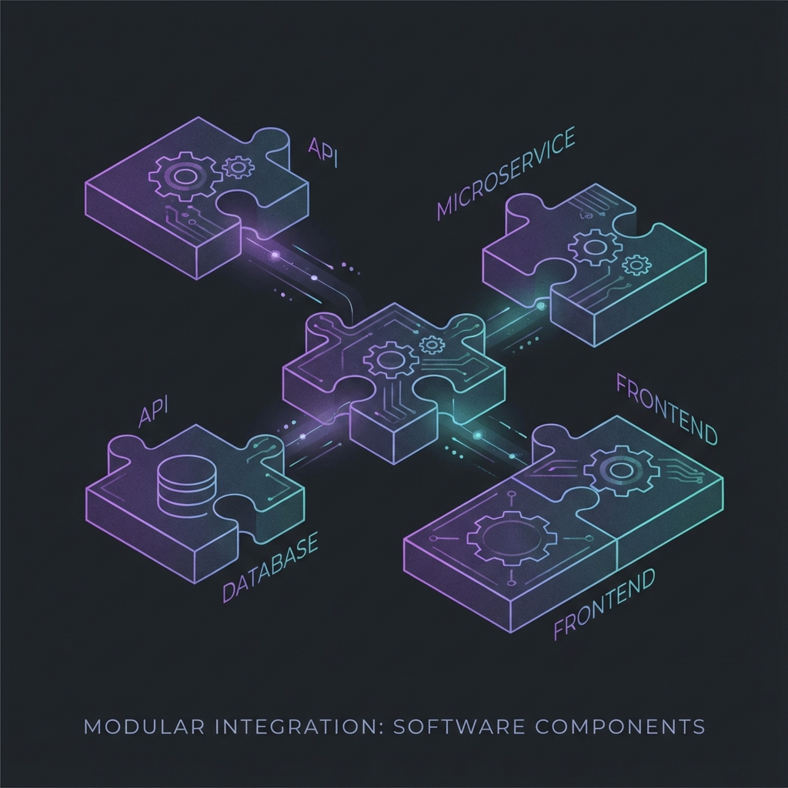
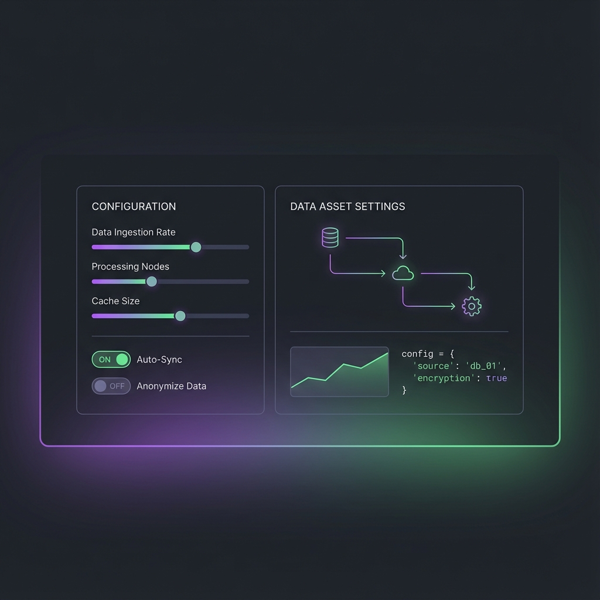
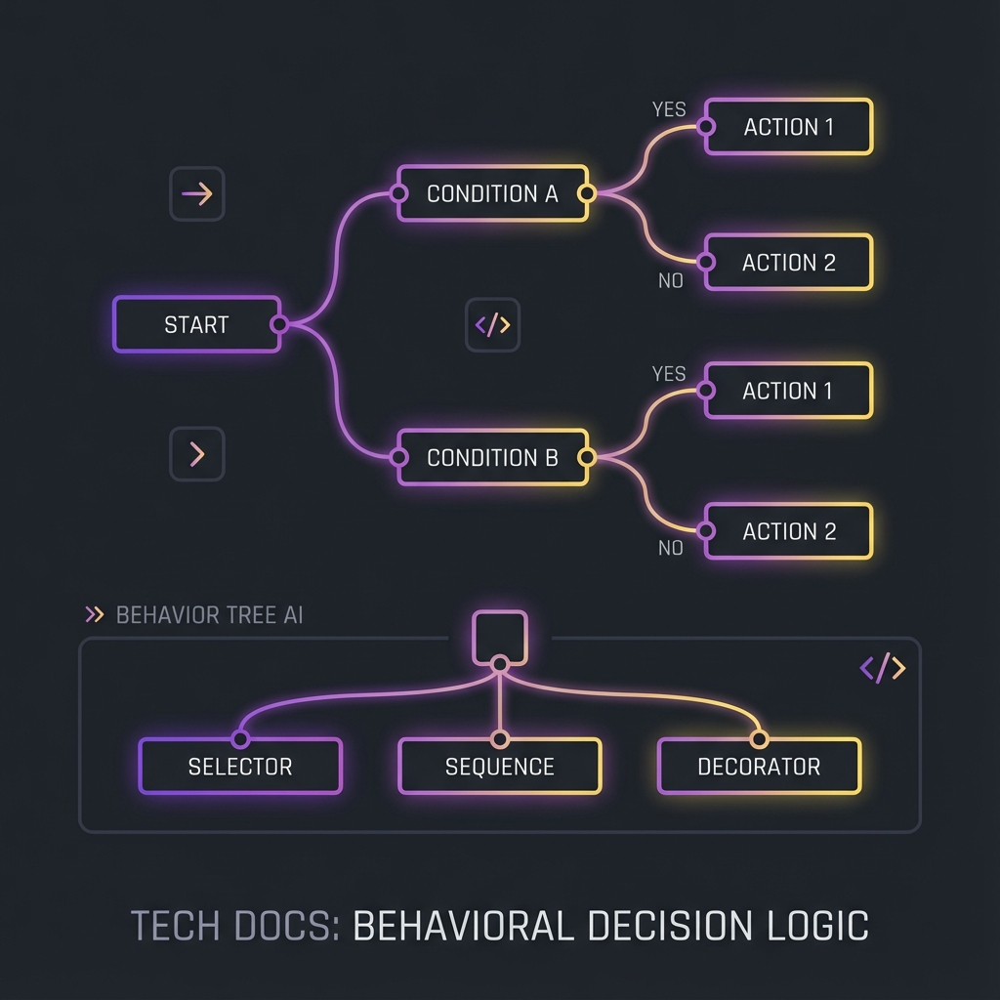
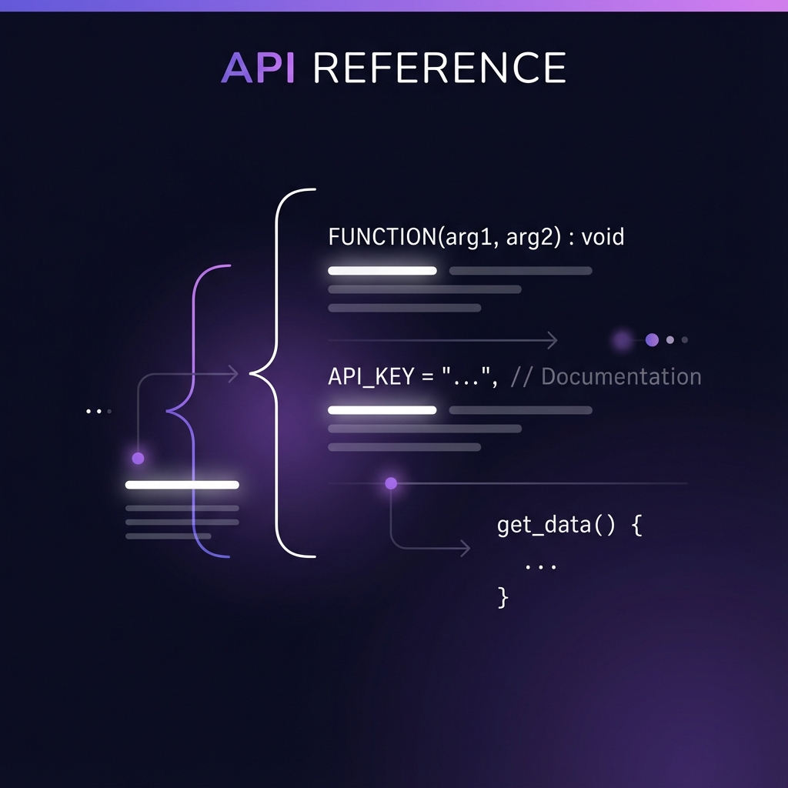

## Overview

**SoulslikeCombat** is a production-ready AI combat plugin for Unreal Engine 5.7. It provides intelligent, tactical enemy behavior for souls-like and action RPG games through a modular component system.

### What's Included

- ✅ Complete C++ source code
- ✅ Blueprint-compatible components and tasks
- ✅ Demo level with fully functional enemy
- ✅ Example weapons, abilities, and action configurations
- ✅ StateTree and Behavior Tree integration
- ✅ Comprehensive documentation

### Who This Is For

- Developers creating souls-like, action RPG, or tactical combat games
- Teams needing production-ready AI without building from scratch
- Designers who want data-driven AI configuration without code
- Projects using Gameplay Ability System (GAS) for combat

---

## Documentation Sections

<a href="/docs/soulslike-combat/getting-started" className="doc-card rounded-lg border border-border hover:border-primary/50 transition-all duration-300 bg-card block overflow-hidden">
  

    
    

  

  

    <h3 className="text-lg font-semibold mb-3">Getting Started</h3>
    
Installation, quick start, and your first enemy in 10 minutes.

  

</a>

<a href="/docs/soulslike-combat/architecture" className="doc-card rounded-lg border border-border hover:border-primary/50 transition-all duration-300 bg-card block overflow-hidden">
  

    
    

  

  

    <h3 className="text-lg font-semibold mb-3">Core Architecture</h3>
    
Understanding the StateTree + Behavior Tree hybrid architecture.

  

</a>

<a href="/docs/soulslike-combat/step-by-step-enemy" className="doc-card rounded-lg border border-border hover:border-primary/50 transition-all duration-300 bg-card block overflow-hidden">
  

    
    

  

  

    <h3 className="text-lg font-semibold mb-3">Step-by-Step Enemy</h3>
    
Comprehensive guide to creating a complete enemy from scratch.

  

</a>

<a href="/docs/soulslike-combat/components" className="doc-card rounded-lg border border-border hover:border-primary/50 transition-all duration-300 bg-card block overflow-hidden">
  

    
    

  

  

    <h3 className="text-lg font-semibold mb-3">Components Reference</h3>
    
MovementEvaluator, ActionEvaluation, ThreatDetection, and more.

  

</a>

<a href="/docs/soulslike-combat/configuration" className="doc-card rounded-lg border border-border hover:border-primary/50 transition-all duration-300 bg-card block overflow-hidden">
  

    
    

  

  

    <h3 className="text-lg font-semibold mb-3">Configuration Assets</h3>
    
ActionSets, Movement Profiles, and Damage Configs.

  

</a>

<a href="/docs/soulslike-combat/statetree" className="doc-card rounded-lg border border-border hover:border-primary/50 transition-all duration-300 bg-card block overflow-hidden">
  

    
    

  

  

    <h3 className="text-lg font-semibold mb-3">StateTree Integration</h3>
    
StateTree tasks, structure, and setup guide.

  

</a>

<a href="/docs/soulslike-combat/behavior-trees" className="doc-card rounded-lg border border-border hover:border-primary/50 transition-all duration-300 bg-card block overflow-hidden">
  

    
    

  

  

    <h3 className="text-lg font-semibold mb-3">Behavior Tree Tasks</h3>
    
BT tasks and auto-populated blackboard keys.

  

</a>

<a href="/docs/soulslike-combat/patterns" className="doc-card rounded-lg border border-border hover:border-primary/50 transition-all duration-300 bg-card block overflow-hidden">
  

    
    

  

  

    <h3 className="text-lg font-semibold mb-3">Patterns and Examples</h3>
    
Ready-to-use patterns for melee, defensive, and aggressive enemies.

  

</a>

<a href="/docs/soulslike-combat/api-reference" className="doc-card rounded-lg border border-border hover:border-primary/50 transition-all duration-300 bg-card block overflow-hidden">
  

    
    

  

  

    <h3 className="text-lg font-semibold mb-3">API Reference</h3>
    
Technical API reference for base classes and functions.

  

</a>

<a href="/docs/soulslike-combat/troubleshooting" className="doc-card rounded-lg border border-border hover:border-primary/50 transition-all duration-300 bg-card block overflow-hidden">
  

    
    

  

  

    <h3 className="text-lg font-semibold mb-3">Troubleshooting</h3>
    
Debug logging, common issues, FAQ, and support.

  

</a>

---

## Support and Resources

**Purchase:** [Fab Marketplace](https://www.fab.com/)

**Support:** Contact through Fab Marketplace or via this website's contact form

**Updates:** Plugin updates delivered through Fab Marketplace to all buyers

---

**SoulslikeCombat** - Built by **Hakan Erunsal** to save developers time and provide a professional foundation for action combat AI.
