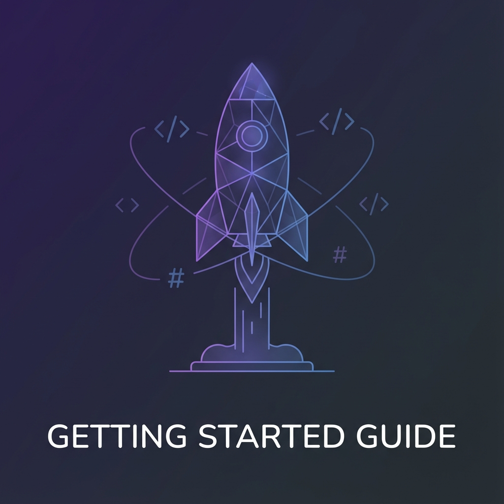
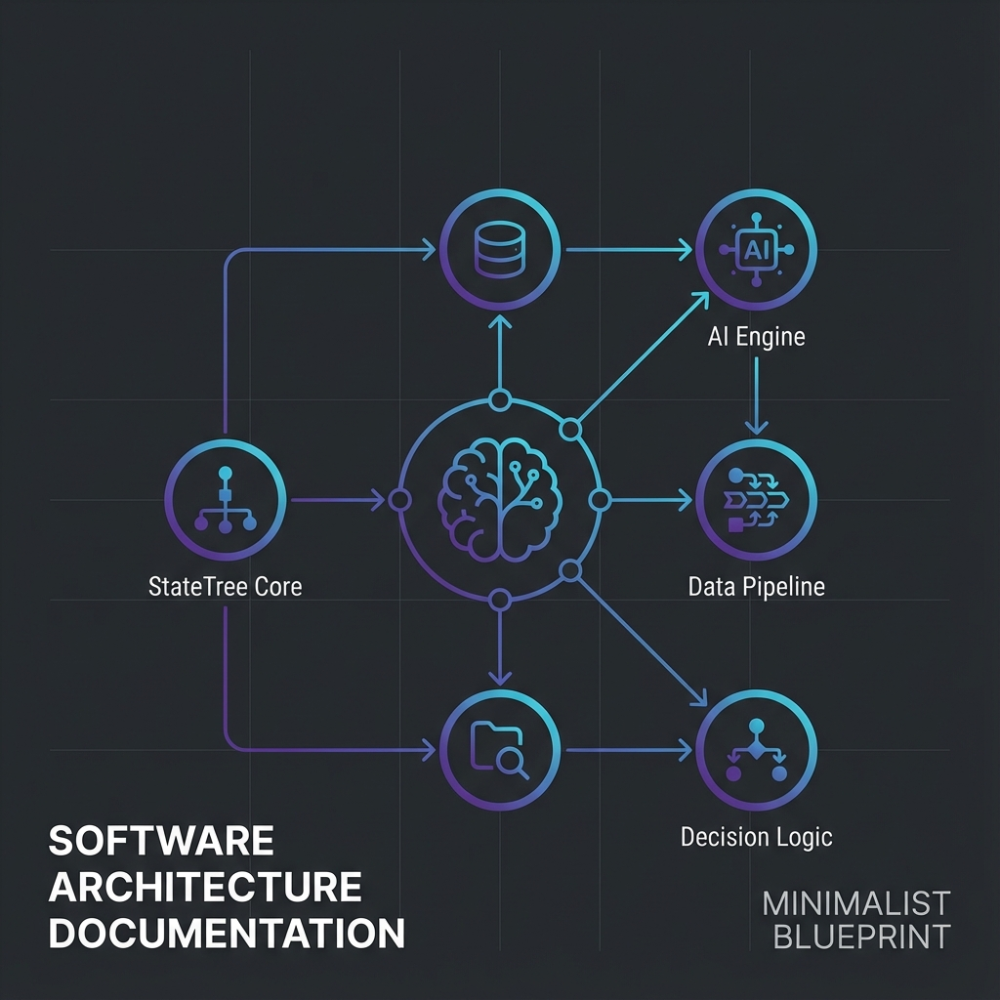
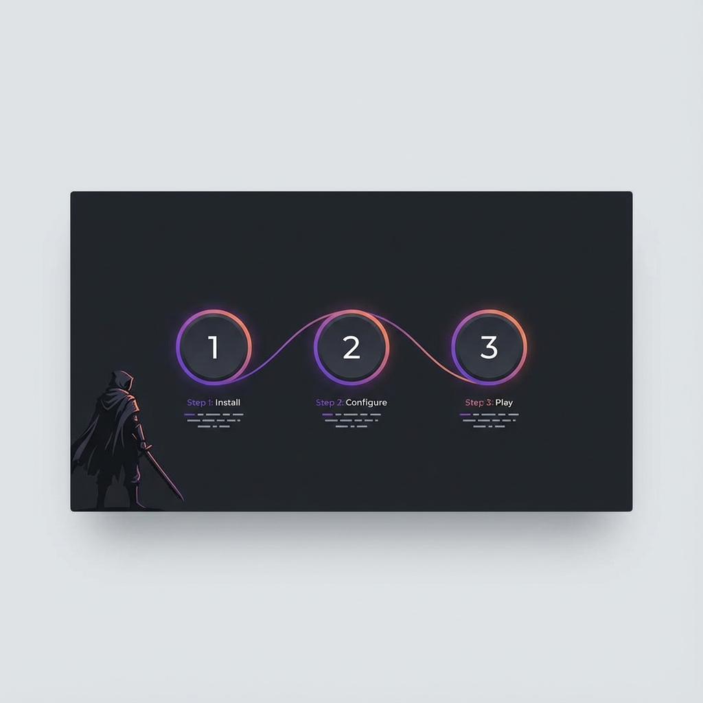
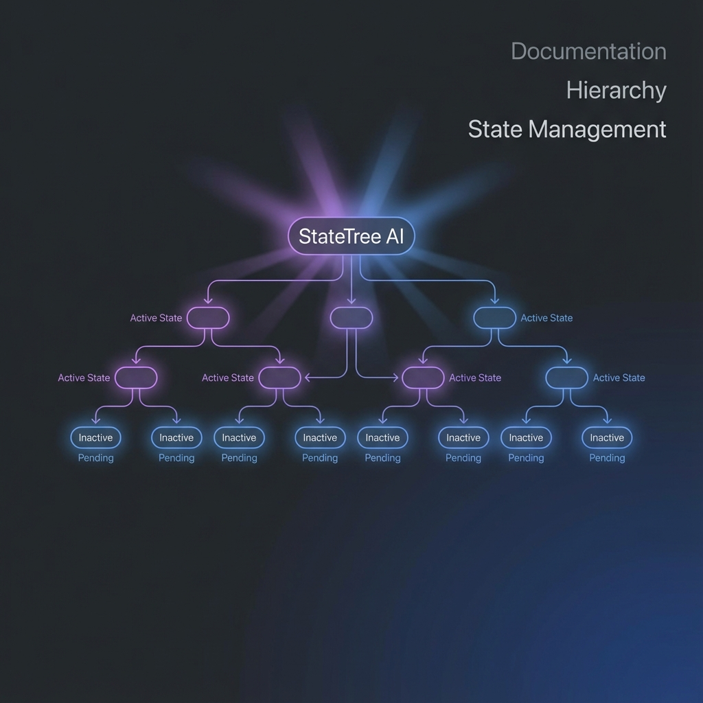
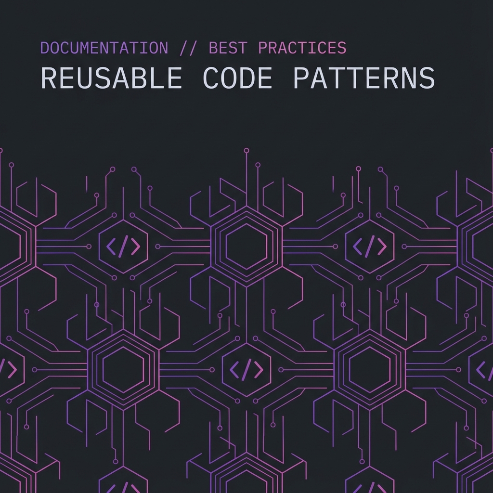
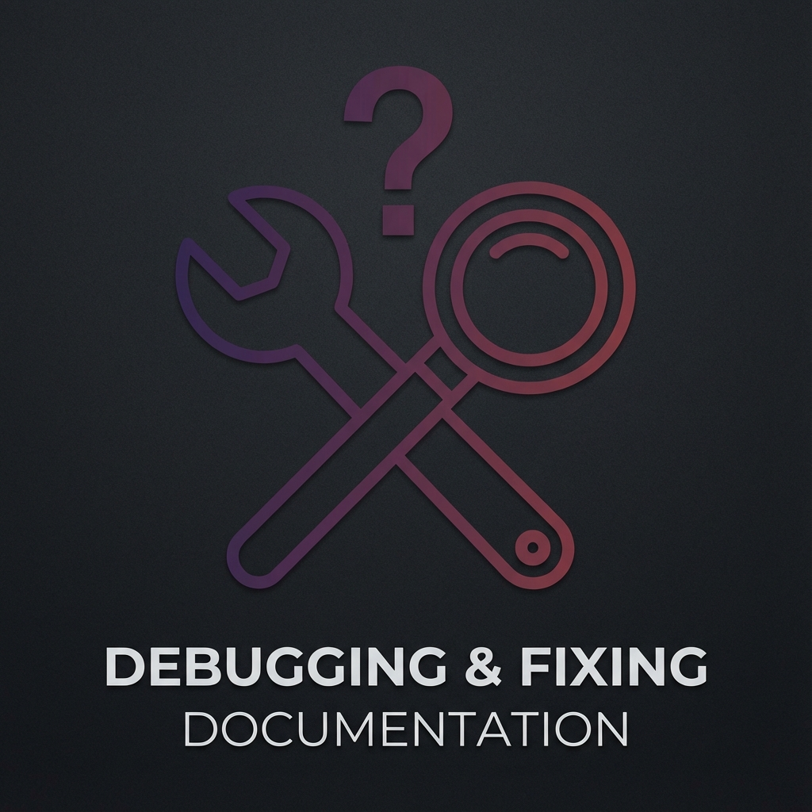
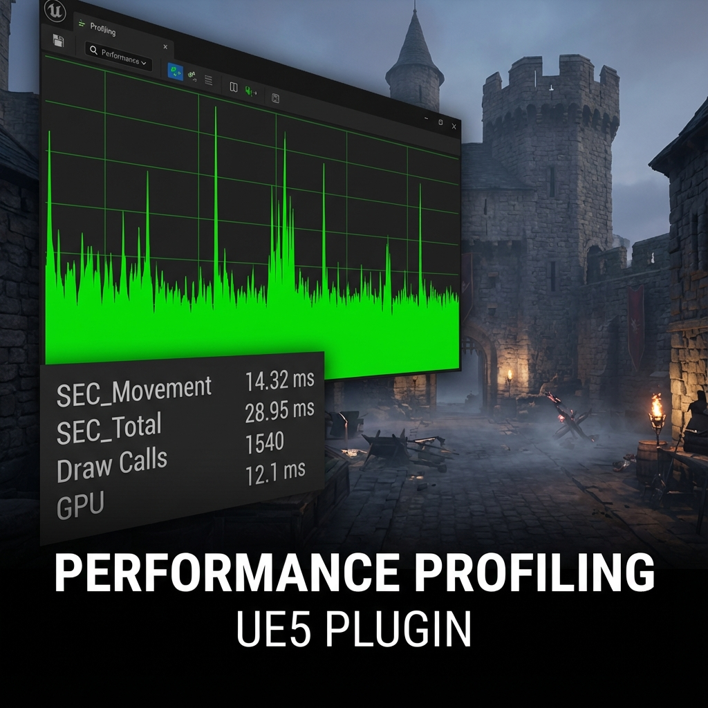

## Overview

**SoulslikeEnemyCombat** is a production-ready AI combat plugin for Unreal Engine 5.6+. It provides intelligent, tactical enemy behavior for souls-like and action RPG games through a modular component system. Supports single-player, listen server, and dedicated server configurations.

The plugin consists of **8 systems** that work together: Movement, Actions, Reactions, Combat Roles, Threat Detection, Awareness, Melee Trace, and Vitals. Each system can also be used independently if you only need specific functionality.

### How the Components Connect

Config drives the controller; the controller decides; the pawn holds movelists and runs abilities. Use the step guide below, then switch to **Full wiring** to see every component and click for resolution chains.

<SystemArchitectureVisualizer />

### What's Included

- ✅ Complete C++ source code
- ✅ Data-driven Role Integration (AI Config)
- ✅ Blueprint-compatible components and tasks
- ✅ Demo level with fully functional enemy
- ✅ Example weapons, abilities, and action configurations
- ✅ StateTree and Behavior Tree integration
- ✅ Comprehensive documentation

---

## Getting Started

<a href="/docs/soulslike-combat/getting-started" className="doc-card rounded-lg border border-border hover:border-primary/50 transition-all duration-300 bg-card block overflow-hidden">
  

    
    

  

  

    <h3 className="text-lg font-semibold mb-3">Getting Started</h3>
    
Installation, quick start, and your first enemy in 10 minutes.

  

</a>

<a href="/docs/soulslike-combat/architecture" className="doc-card rounded-lg border border-border hover:border-primary/50 transition-all duration-300 bg-card block overflow-hidden">
  

    
    

  

  

    <h3 className="text-lg font-semibold mb-3">Core Architecture</h3>
    
Understanding the StateTree + Behavior Tree hybrid architecture.

  

</a>

<a href="/docs/soulslike-combat/step-by-step-enemy" className="doc-card rounded-lg border border-border hover:border-primary/50 transition-all duration-300 bg-card block overflow-hidden">
  

    
    

  

  

    <h3 className="text-lg font-semibold mb-3">Step-by-Step Enemy</h3>
    
Comprehensive guide to creating a complete enemy from scratch.

  

</a>

---

## Systems Deep Dive

Each system is independent and can be used standalone. Click to learn how each works.

<a href="/docs/soulslike-combat/movement-system" className="doc-card rounded-lg border border-border hover:border-primary/50 transition-all duration-300 bg-card block p-6">
  <h3 className="text-lg font-semibold mb-2">🎯 Movement System</h3>
  
Tactical positioning, strafing, distance maintenance, pawn avoidance.

</a>

<a href="/docs/soulslike-combat/action-system" className="doc-card rounded-lg border border-border hover:border-primary/50 transition-all duration-300 bg-card block p-6">
  <h3 className="text-lg font-semibold mb-2">⚔️ Action System</h3>
  
Scoring-based action selection, cooldowns, Ability/BT execution.

</a>

<a href="/docs/soulslike-combat/action-set-editor" className="doc-card rounded-lg border border-border hover:border-primary/50 transition-all duration-300 bg-card block p-6">
  <h3 className="text-lg font-semibold mb-2">🗺️ Action Set Editor</h3>
  
Lay a moveset out as cards, wire combos, and watch the AI decide while the game runs.

</a>

<a href="/docs/soulslike-combat/reaction-system" className="doc-card rounded-lg border border-border hover:border-primary/50 transition-all duration-300 bg-card block p-6">
  <h3 className="text-lg font-semibold mb-2">🛡️ Reaction System</h3>
  
Event-driven parry, dodge, and counter reactions to game stimuli.

</a>

<a href="/docs/soulslike-combat/combat-roles" className="doc-card rounded-lg border border-border hover:border-primary/50 transition-all duration-300 bg-card block p-6">
  <h3 className="text-lg font-semibold mb-2">🎖️ Combat Roles</h3>
  
Multi-enemy coordination with Attacker, Flanker, Waiter roles.

</a>

<a href="/docs/soulslike-combat/targeting-system" className="doc-card rounded-lg border border-border hover:border-primary/50 transition-all duration-300 bg-card block p-6">
  <h3 className="text-lg font-semibold mb-2">🎯 Targeting System</h3>
  
Multi-target support, intelligent selectors, orphan handling for co-op.

</a>

<a href="/docs/soulslike-combat/threat-detection" className="doc-card rounded-lg border border-border hover:border-primary/50 transition-all duration-300 bg-card block p-6">
  <h3 className="text-lg font-semibold mb-2">👁️ Threat Detection</h3>
  
Track player camera attention and react when observed.

</a>

<a href="/docs/soulslike-combat/awareness-system" className="doc-card rounded-lg border border-border hover:border-primary/50 transition-all duration-300 bg-card block p-6">
  <h3 className="text-lg font-semibold mb-2">🧠 Awareness System</h3>
  
Per-AI perception memory; enemies engage only what they have sensed.

</a>

<a href="/docs/soulslike-combat/melee-trace" className="doc-card rounded-lg border border-border hover:border-primary/50 transition-all duration-300 bg-card block p-6">
  <h3 className="text-lg font-semibold mb-2">🗡️ Melee Trace</h3>
  
Frame-rate independent hit detection with swept traces.

</a>

<a href="/docs/soulslike-combat/vitals" className="doc-card rounded-lg border border-border hover:border-primary/50 transition-all duration-300 bg-card block p-6">
  <h3 className="text-lg font-semibold mb-2">❤️ Vitals</h3>
  
Health, stamina, and stance pools that gate and score what an enemy does.

</a>

<a href="/docs/soulslike-combat/animation-integration" className="doc-card rounded-lg border border-border hover:border-primary/50 transition-all duration-300 bg-card block p-6">
  <h3 className="text-lg font-semibold mb-2">🎬 Animation Integration</h3>
  
Gameplay tags wired to anim Blueprint bools, loose tags held for a montage window.

</a>

<a href="/docs/soulslike-combat/configuration" className="doc-card rounded-lg border border-border hover:border-primary/50 transition-all duration-300 bg-card block p-6">
  <h3 className="text-lg font-semibold mb-2">⚙️ Configuration Reference</h3>
  
All data assets: ActionSets, Profiles, Damage Configs.

</a>

<a href="/docs/soulslike-combat/multiplayer" className="doc-card rounded-lg border border-border hover:border-primary/50 transition-all duration-300 bg-card block p-6">
  <h3 className="text-lg font-semibold mb-2">🌐 Multiplayer</h3>
  
Replication architecture, server authority, and client-side state.

</a>

---

## Reference & Examples

<a href="/docs/soulslike-combat/statetree" className="doc-card rounded-lg border border-border hover:border-primary/50 transition-all duration-300 bg-card block overflow-hidden">
  

    
    

  

  

    <h3 className="text-lg font-semibold mb-3">StateTree Tasks</h3>
    
Available StateTree tasks and structure guide.

  

</a>

<a href="/docs/soulslike-combat/patterns" className="doc-card rounded-lg border border-border hover:border-primary/50 transition-all duration-300 bg-card block overflow-hidden">
  

    
    

  

  

    <h3 className="text-lg font-semibold mb-3">Patterns & Examples</h3>
    
Ready-to-use patterns for melee, defensive, and aggressive enemies.

  

</a>

<a href="/docs/soulslike-combat/troubleshooting" className="doc-card rounded-lg border border-border hover:border-primary/50 transition-all duration-300 bg-card block overflow-hidden">
  

    
    

  

  

    <h3 className="text-lg font-semibold mb-3">Troubleshooting</h3>
    
Debug logging, common issues, FAQ, and support.

  

</a>

<a href="/docs/soulslike-combat/performance" className="doc-card rounded-lg border border-border hover:border-primary/50 transition-all duration-300 bg-card block overflow-hidden">
  

    
    

  

  

    <h3 className="text-lg font-semibold mb-3">Performance</h3>
    
Benchmarks, profiling tools, and optimization guidance.

  

</a>

---

## Roadmap

Check out the [public Trello roadmap](https://trello.com/b/gN7Fxryx/soulslike-enemy-combat-plugin-roadmap) to see what's coming next.

### Shipped
- ✅ **Multiplayer Support**: Server-authoritative AI with replicated state for listen and dedicated servers

---

## Support and Resources

  <a href="https://www.fab.com/listings/7087cec0-6975-4de5-82e0-0de0b9b3e9a7" target="_blank" rel="noopener noreferrer" style={{ display: 'inline-flex', alignItems: 'center', gap: '8px', padding: '10px 20px', backgroundColor: 'rgba(250, 92, 92, 0.1)', color: '#fa5c5c', textDecoration: 'none', borderRadius: '8px', fontWeight: '500', border: '1px solid rgba(250, 92, 92, 0.3)', fontSize: '14px' }}>
    🛒 Get on Fab Marketplace
  </a>
  <a href="https://drive.google.com/file/d/1N9-JDj1Fa8xqO0sfA3JA8FNDVMnx7pvt/view?usp=drive_link" target="_blank" rel="noopener noreferrer" style={{ display: 'inline-flex', alignItems: 'center', gap: '8px', padding: '10px 20px', backgroundColor: 'rgba(76, 175, 80, 0.1)', color: '#4CAF50', textDecoration: 'none', borderRadius: '8px', fontWeight: '500', border: '1px solid rgba(76, 175, 80, 0.3)', fontSize: '14px' }}>
    📦 Sample Project
  </a>
  <a href="https://trello.com/b/gN7Fxryx/soulslike-enemy-combat-plugin-roadmap" target="_blank" rel="noopener noreferrer" style={{ display: 'inline-flex', alignItems: 'center', gap: '8px', padding: '10px 20px', backgroundColor: 'rgba(156, 39, 176, 0.1)', color: '#9C27B0', textDecoration: 'none', borderRadius: '8px', fontWeight: '500', border: '1px solid rgba(156, 39, 176, 0.3)', fontSize: '14px' }}>
    🗺️ Roadmap
  </a>
  <a href="https://discord.com/invite/CbRcTsYQcz" target="_blank" rel="noopener noreferrer" style={{ display: 'inline-flex', alignItems: 'center', gap: '8px', padding: '10px 20px', backgroundColor: 'rgba(88, 101, 242, 0.1)', color: '#5865F2', textDecoration: 'none', borderRadius: '8px', fontWeight: '500', border: '1px solid rgba(88, 101, 242, 0.3)', fontSize: '14px' }}>
    💬 Discord Support
  </a>

---

**SoulslikeEnemyCombat** - Built by **Hakan Erunsal** to save developers time and provide a professional foundation for action combat AI.
