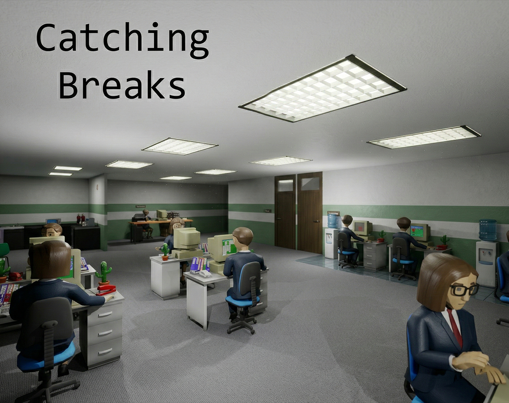

## Catching Breaks

  

  

    <h3 style={{ margin: '0 0 16px 0', fontSize: '18px', fontWeight: '600' }}>Itch.io</h3>
    <ul style={{ margin: '0 0 20px 0', paddingLeft: '20px', fontSize: '14px', lineHeight: '1.8' }}>
      <li>Platform: Windows</li>
      <li>Game Jam: 2025 Epic MegaJam</li>
      <li>Theme: "Here we go again"</li>
    </ul>
    <a href='https://itch.io/jam/2025-epic-megajam/rate/3982101' target="_blank" rel="noopener noreferrer" style={{ display: 'block', padding: '12px 24px', backgroundColor: '#fa5c5c', color: 'white', textDecoration: 'none', borderRadius: '8px', fontWeight: '600', textAlign: 'center', fontSize: '14px' }}>
      Play on Itch.io
    </a>
  

  

    <h3 style={{ margin: '0 0 16px 0', fontSize: '18px', fontWeight: '600' }}>Team</h3>
    <ul style={{ margin: '0 0 20px 0', paddingLeft: '20px', fontSize: '14px', lineHeight: '1.8' }}>
      <li>Developer: Hakan Erunsal</li>
      <li>Character Artist: <a href="https://www.linkedin.com/in/florentina-vh/" target="_blank" rel="noopener noreferrer" style={{ whiteSpace: 'nowrap', color: '#ff6b6b' }}>Florentina von Haus</a></li>
      <li>Engine: Unreal Engine 5.6.1</li>
    </ul>
    <a href='https://www.youtube.com/watch?v=fWN5sRZWjFc' target="_blank" rel="noopener noreferrer" style={{ display: 'block', padding: '12px 24px', backgroundColor: '#ff0000', color: 'white', textDecoration: 'none', borderRadius: '8px', fontWeight: '600', textAlign: 'center', fontSize: '14px' }}>
      Watch Gameplay
    </a>
  

### Overview

Catching Breaks is a comedic office management game created for the 2025 Epic MegaJam. Fix office chaos, dodge awkward small talk, and put out literal fires - but no matter how often you fix something, it always breaks again. The game perfectly captures the theme "Here we go again" through its endless cycle of workplace disasters.

### Development Journey

This project was created for the 2025 Epic MegaJam as part of Team Overtimers. Working with Unreal Engine 5.6.1, I was responsible for all aspects of development including game design, programming, level design, and gameplay systems. The only exception was the character animations and mesh design, which were brilliantly created by <a href="https://www.linkedin.com/in/florentina-vh/" target="_blank" rel="noopener noreferrer">Florentina von Haus</a>.

The game received positive feedback from players, with reviewers praising its humor, art style, and how well it captures the jam's theme of repetitive cycles.

### Key Techniques and Learnings

- **Game Jam Development:** Completed a full game within the tight timeframe of a game jam while maintaining quality and polish.
- **Quick-Time Event System:** Implemented an engaging quick-time event system for the repair mechanics that keeps players on their toes.
- **Procedural Problem Generation:** Created a system to randomly generate office problems that need fixing, ensuring replayability.
- **Comedy Through Gameplay:** Designed gameplay loops that naturally create humorous situations through escalating chaos.
- **Team Collaboration:** Worked effectively with a character artist to integrate custom animations and models into the gameplay systems.

### Gameplay

Players navigate an office environment responding to various disasters:
- **Controls:** WASD movement, Shift to sprint, E to interact, Left Click to repair
- **Quick-Time Events:** Perform button sequences to successfully fix problems
- **Time Pressure:** Manage multiple problems simultaneously as chaos escalates
- **Theme Integration:** Experience the frustration and humor of fixing the same issues repeatedly

### In-Game Visuals

<ZoomableImage
  src="../images/catchingbreaks_screenshot1.jpg"
/>

<ZoomableImage
  src="../images/catchingbreaks_screenshot2.jpg"
/>

<ZoomableImage
  src="../images/catchingbreaks_screenshot3.jpg"
/>

### Reflection

Catching Breaks was a fantastic game jam experience that pushed me to create a complete, polished game under time constraints. The positive reception from players - who loved the humor, art style, and gameplay loop - validated our design choices. Working with <a href="https://www.linkedin.com/in/florentina-vh/" target="_blank" rel="noopener noreferrer">Florentina von Haus</a> on the character work enriched the project and demonstrated the value of focused collaboration even in short jam timeframes.

The project showcased my ability to rapidly prototype, iterate, and ship a fun, cohesive game while maintaining the quality standards I've developed through my commercial mobile game work.

