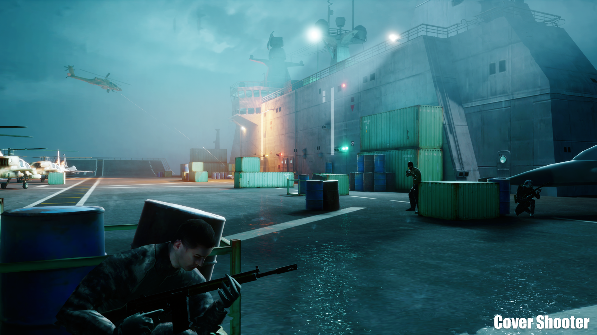
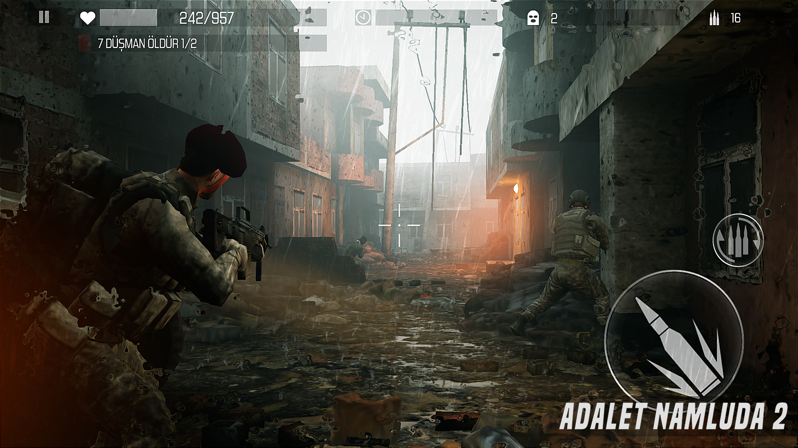

## Cover Shooter: Gun Shooting

  

  

    <h3 style={{ textAlign: 'left' }}>Android</h3>
    <ul>
      <li>Rating: 4.0★</li>
      <li>Downloads: 300K+</li>
      <li>Reviews: 800+</li>
    </ul>
    

      
    

  

  

    <h3 style={{ textAlign: 'left' }}>IOS</h3>
    <ul>
      <li>Rating: 4.3★</li>
      <li>Downloads: 100K+</li>
      <li>Reviews: 500+</li>
    </ul>
    

      
    

  

### Overview

Cover Shooter is my latest and most ambitious project. It's a third-person cover shooter for mobile that's all about smooth performance and scalability. I poured a lot into this one to make it something special.

### Development Journey

This game was a real test of everything I'd learned. I needed it to look amazing and run well on all kinds of devices. Since I was working alone on this project, I had to dive into many different systems which are generally their individual rabbit-holes. I dived into some serious optimization techniques and came up with creative solutions to keep things running smoothly.

### Key Techniques and Learnings

- **Instanced Static Mesh Systems:** These were crucial for keeping rendering efficient both for generating procedural worlds for easy level generation and optimization and reusage of the dynamic objects.
- **Niagara Particle Effects:** Helped me add beautiful effects without a performance hit. For someone who is really used to handling ordered iterations and easy access on CPU to handle data in a smooth and good looking way on GPU level was a challenge.
- **Transparent Particles Optimization:** Especially the bullet trails when there are 10 enemies + the player shooting was a huge impact on performance. Used some tricks to make transparent particles run better.
- **Improved C++ Code Optimization:** Took my C++ skills to the next level to ensure super-fast execution. Most of the calculations that are done in Blueprints work so much faster just by moving it to C++ code.

Working on this project really pushed me to improve my optimization strategies and design methods, resulting in a polished and efficient game.

### Screenshots

