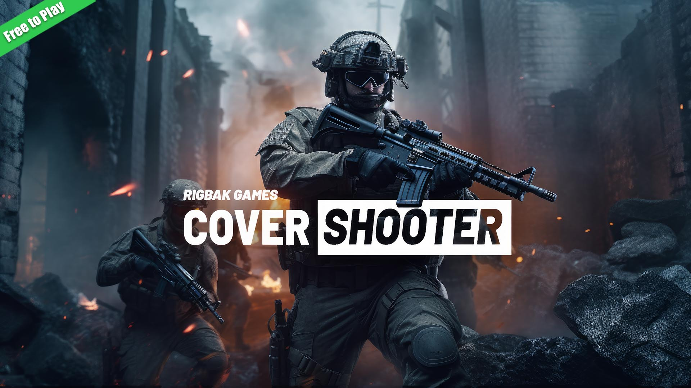

## Cover Shooter: Gun Shooting

  

    <h3 style={{ margin: '0 0 16px 0', fontSize: '18px', fontWeight: '600' }}>Android</h3>
    <ul style={{ margin: '0 0 20px 0', paddingLeft: '20px', fontSize: '14px', lineHeight: '1.8' }}>
      <li>Rating: 4.1★</li>
      <li>Downloads: 300K+</li>
      <li>Reviews: 800+</li>
    </ul>
    <a href='https://play.google.com/store/apps/details?id=com.rigbakgames.covershooter3d' target="_blank" rel="noopener noreferrer" style={{ display: 'block', padding: '12px 24px', backgroundColor: '#34a853', color: 'white', textDecoration: 'none', borderRadius: '8px', fontWeight: '600', textAlign: 'center', fontSize: '14px' }}>
      Get on Google Play
    </a>
  

  

    <h3 style={{ margin: '0 0 16px 0', fontSize: '18px', fontWeight: '600' }}>iOS</h3>
    <ul style={{ margin: '0 0 20px 0', paddingLeft: '20px', fontSize: '14px', lineHeight: '1.8' }}>
      <li>Rating: 4.3★</li>
      <li>Downloads: 100K+</li>
      <li>Reviews: 500+</li>
    </ul>
    <a href="https://apps.apple.com/us/app/cover-shooter-free-fire-games/id1505399592" target="_blank" rel="noopener noreferrer" style={{ display: 'block', padding: '12px 24px', backgroundColor: '#007aff', color: 'white', textDecoration: 'none', borderRadius: '8px', fontWeight: '600', textAlign: 'center', fontSize: '14px' }}>
      Download on App Store
    </a>
  

### Overview

Cover Shooter is my latest and most ambitious project. It's a third-person cover shooter for mobile that's all about smooth performance and scalability. I poured a lot into this one to make it something special.

### Development Journey

This game was a real test of everything I'd learned. I needed it to look amazing and run well on all kinds of devices. Since I was working alone on this project, I had to dive into many different systems which are generally their individual rabbit-holes. I dived into some serious optimization techniques and came up with creative solutions to keep things running smoothly.

### Key Techniques and Learnings

- **Instanced Static Mesh Systems:** These were crucial for keeping rendering efficient both for generating procedural worlds for easy level generation and optimization and reusage of the dynamic objects.
- **Niagara Particle Effects:** Helped me add beautiful effects without a performance hit. For someone who is really used to handling ordered iterations and easy access on CPU to handle data in a smooth and good looking way on GPU level was a challenge.
- **Transparent Particles Optimization:** Especially the bullet trails when there are 10 enemies + the player shooting was a huge impact on performance. Used some tricks to make transparent particles run better.
- **Improved C++ Code Optimization:** Took my C++ skills to the next level to ensure super-fast execution. Most of the calculations that are done in Blueprints work so much faster just by moving it to C++ code.

Working on this project really pushed me to improve my optimization strategies and design methods, resulting in a polished and efficient game.

### In-Game Visuals

  <VideoLoop src="../images/covershooter_video1.mp4" className="w-full h-auto rounded-none shadow-lg" />

<ZoomableImage
src="../images/covershooter_screenshot1.jpg"
/>

<ZoomableImage
src="../images/covershooter_screenshot2.jpg"
/>

<ZoomableImage
src="../images/covershooter_screenshot3.jpg"
/>