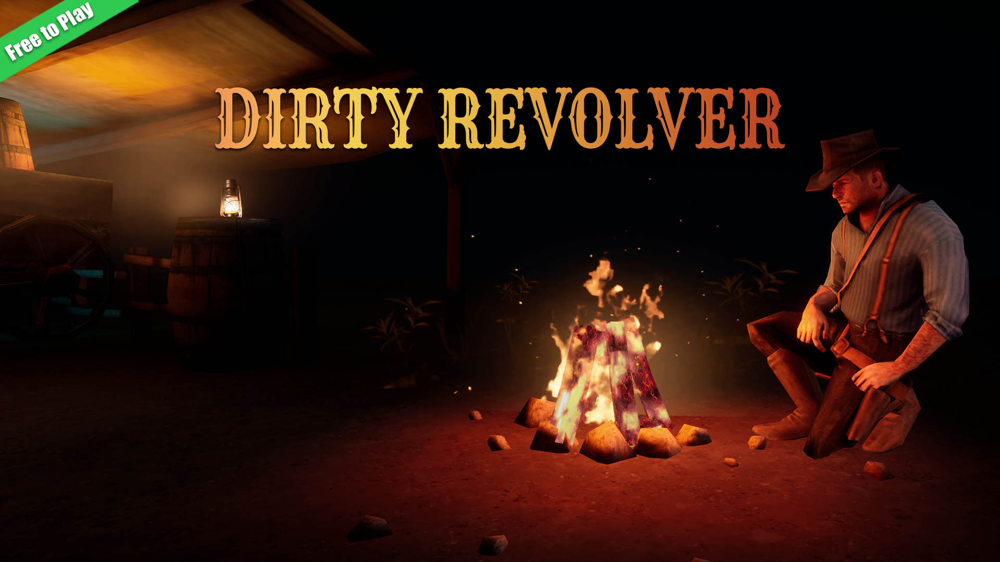

## Dirty Revolver: Cowboy Shooter Game

  

  

    <h3 style={{ textAlign: 'left' }}>Android</h3>
    <ul>
      <li>Rating: 4.1★</li>
      <li>Downloads: 730k+</li>
      <li>Reviews: 1.5k+</li>
    </ul>
    

      
      
Not available

    

  

    

    <h3 style={{ textAlign: 'left' }}>Android</h3>
    <ul>
      <li>Rating: 4.3★</li>
      <li>Downloads: 500k+</li>
      <li>Reviews: 1k+</li>
    </ul>
    

      
      
Not available

    

  

### Overview

Dirty Revolver is a third-person western cowboy shooter game with immersive gameplay and stunning graphics. This project was a collaboration with another company where I worked as the sole developer, supported by a team of talented artists. 

### Development Journey

I made this game when i was working at DreamboxTV. Making Dirty Revolver was a unique adventure. As the only developer on the project, I was responsible for everything from coding and optimization to deploying, testing, debugging, and bug fixing. I worked with very talented artists who brought the Wild West to life, and it was my job to ensure the game ran smoothly and was engaging for players.

### Key Techniques and Learnings

- **Managing Art Team:** Majority of my experience of managing a team of artists and assets comes from this project.
- **Comprehensive Development:** I made the skeleton and character rigging. As well as the animation setup in Animation Blueprints. Took on all aspects of development, including coding, optimization, testing, and deployment.
- **Dynamic Weather Conditions:** Developed a system to handle different weather conditions such as rain, snow, sunny, and stormy weather to enhance the gameplay experience. On mobile development with this low budgets, you have to recycle a lot of things without letting player notice.
- **Optimization for Mobile:** Ensured the game performed well on a wide range of mobile devices through extensive optimization and testing.

### In-Game Visuals

  <VideoLoop src="../images/dirtyrevolver_video1.mp4" className="w-full h-auto rounded-none shadow-lg" />

<ZoomableImage
  src="../images/dirtyrevolver_screenshot1.jpg"
/>

<ZoomableImage
  src="../images/dirtyrevolver_screenshot2.jpg"
/>

<ZoomableImage
  src="../images/dirtyrevolver_screenshot3.jpg"
/>

### Reflection

Working on Dirty Revolver was a deeply rewarding experience. It pushed me to refine my skills and tackle new challenges, from creating dynamic weather systems to optimizing for performance on mobile devices. The collaboration with artists was inspiring, and seeing the positive feedback from players was incredibly gratifying.
