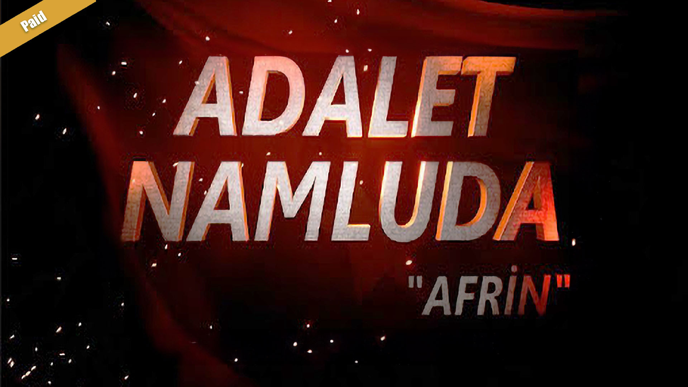

## Justice Gun: Afrin

  

  

    <h3 style={{ textAlign: 'left' }}>Android</h3>
    <ul>
      <li>Rating: 3.7★</li>
      <li>Downloads: 51k+ (Paid)</li>
      <li>Reviews: 2.8k+</li>
    </ul>
    

      
    

  

  

    <h3 style={{ textAlign: 'left' }}>IOS</h3>
    <ul>
      <li>Rating: N/A</li>
      <li>Downloads: 53K+ (Paid)</li>
      <li>Reviews: N/A</li>
    </ul>
    

      
    

  

### Overview

Justice Gun: Afrin is my first game project, a realistic 3D mobile shooter set in Afrin where players take on the role of a Turkish soldier equipped with authentic Turkish army gear. This project was my introduction to the world of game development, where I learned the essential elements of creating a game from scratch.

### Development Journey

Working on Justice Gun Afrin was a pivotal experience in my game development career. It was here that I learned the fundamental principles of game design and development. From coding and optimization to testing and deployment, this project laid the groundwork for my future endeavors in the industry.

### Key Techniques and Learnings

- **Basic Game Mechanics:** Learned to implement basic game mechanics and ensure they functioned smoothly.
- **Simple Optimizations:** Applied simple optimization techniques to improve performance on mobile devices.
- **Foundational Coding Skills:** Developed foundational coding skills in C++ and game development.

### In-Game Visuals

  <VideoLoop src="../images/justicegun_video1.mp4" className="w-full h-auto rounded-none shadow-lg" />

<ZoomableImage
  src="../images/justicegunafrin_screenshot1.jpg"
/>
<ZoomableImage
  src="../images/justicegunafrin_screenshot3.jpg"
/>
<ZoomableImage
  src="../images/justicegunafrin_screenshot2.jpg"
/>

### Reflection

Justice Gun Afrin was a foundational project that taught me the critical aspects of game development. The experience of bringing a realistic, engaging game to life, while working with Turkish army themes and equipment, was incredibly rewarding. This project set the stage for my growth and success in the game development industry.