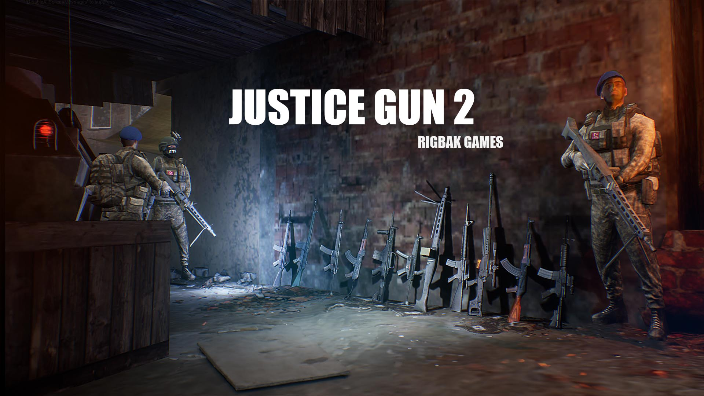

## Justice Gun 2: 3D Shooter Game

  

  

    <h3 style={{ margin: '0 0 16px 0', fontSize: '18px', fontWeight: '600' }}>Android</h3>
    <ul style={{ margin: '0 0 20px 0', paddingLeft: '20px', fontSize: '14px', lineHeight: '1.8' }}>
      <li>Rating: 4.5★</li>
      <li>Downloads: 50k+ (Paid)</li>
      <li>Reviews: 1.9k+</li>
    </ul>
    

      No Longer Available
    

  

  

    <h3 style={{ margin: '0 0 16px 0', fontSize: '18px', fontWeight: '600' }}>Android Demo (F2P)</h3>
    <ul style={{ margin: '0 0 20px 0', paddingLeft: '20px', fontSize: '14px', lineHeight: '1.8' }}>
      <li>Rating: 4.0★</li>
      <li>Downloads: 850k+</li>
      <li>Reviews: 2.8k+</li>
    </ul>
    

      No Longer Available
    

  

### Overview

Justice Gun 2 is a thrilling 3D shooter game that has garnered outstanding reviews and has sold over 50k copies. This project was a solo developer endeavor where I took on every aspect of development.

### Development Journey

Creating Justice Gun 2 was an intense and rewarding experience. Being the sole developer on the project meant that I was responsible for every single detail, ensuring the game was not only fun and engaging but also ran smoothly on a wide range of devices. I handled the coding, optimization, deploying, testing, debugging, and bug fixing entirely on my own.

### Key Techniques and Learnings

- **Code Optimization:** I wrote the entire game in C++ and optimized the code to ensure fast execution and smooth performance.
- **Rendering Techniques:** Utilized advanced rendering techniques to ensure the game looked great without sacrificing performance.
- **Deploying and Testing:** Managed the entire deployment process, ensuring the game was thoroughly tested and free of major bugs before release. This includes implementation of Firebase, Admob and IAP Systems.

### In-Game Visuals

  <VideoLoop src="../images/justicegun2_video1.mp4" className="w-full h-auto rounded-none shadow-lg" />

<ZoomableImage
  src="../images/justicegun2_screenshot1.jpg"
/>
<ZoomableImage
  src="../images/justicegun2_screenshot2.jpg"
/>
<ZoomableImage
  src="../images/justicegun2_screenshot3.jpg"
/>

### Reflection

Working on Justice Gun 2 pushed me to refine my skills in all areas of game development. It was a challenging yet highly rewarding project that taught me a lot about the importance of optimization, attention to detail, and the value of thorough testing. The positive feedback from players and the good sales numbers have been incredibly gratifying, validating the hard work and dedication I poured into this game.