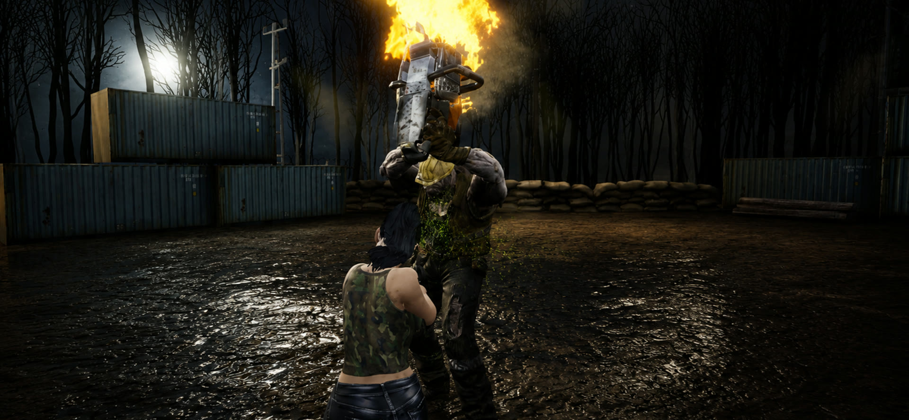

## The Last Line

  

    <h3 style={{ margin: '0 0 16px 0', fontSize: '18px', fontWeight: '600' }}>Android</h3>
    <ul style={{ margin: '0 0 20px 0', paddingLeft: '20px', fontSize: '14px', lineHeight: '1.8' }}>
      <li>Downloads: 10,000+</li>
      <li>Growth: organic</li>
      <li>Live on Google Play</li>
    </ul>
    
  

  

    <h3 style={{ margin: '0 0 16px 0', fontSize: '18px', fontWeight: '600' }}>iOS</h3>
    <ul style={{ margin: '0 0 20px 0', paddingLeft: '20px', fontSize: '14px', lineHeight: '1.8' }}>
      <li>In App Store review</li>
      <li>Same content as Android</li>
      <li>Launching soon</li>
    </ul>
    

      Coming soon
    

  

### Overview

The Last Line is my most ambitious solo project: a zombie survival shooter for mobile that puts console-style set pieces on a phone. You hold a barricade against waves of more than a hundred zombies at once, and every so often a Souls-like boss walks into the arena and the fight changes shape. It is free to play, live on Google Play, and built in Unreal Engine 5.

### Development

I built The Last Line alone in about five months: the gameplay, the systems, the UI, the store setup, and the tools around it, including the Soulslike Enemy Combat framework it runs its bosses on. Almost every hard decision came down to the same trade: spend the frame budget on what the player sees and cut or fake the rest, so the game reads far bigger than the hardware it runs on.

### Key Techniques and Learnings

- **150-zombie horde on a phone:** actor tick is disabled on every zombie and one batch component drives the whole crowd with distance-based update tiers, animation LOD, designer splines instead of navmesh, and object pooling. The system holds a full wave without dropping the frame.
- **Souls-like boss AI:** bosses run on my [Soulslike Enemy Combat](/projects/SoulslikeCombatSystem) plugin, a StateTree strategy layer over Gameplay Ability and Behavior Tree execution, with frame-rate-independent swept melee traces so fast attacks never tunnel through the player.
- **Widget-free combat HUD:** floating damage numbers and hit markers use a fixed pool of structs painted straight onto the HUD canvas, with no UMG and no per-hit allocation, so a busy wave costs the same as a quiet one.
- **Runs from flagship to budget devices:** a per-device quality tiering system reads the real hardware profile (falling back to physical RAM) and applies the right preset before the first frame, hardening the deferred mobile renderer against shader-compile crashes on low-end GPUs.
- **Live-ops and resilience:** a self-healing save layer repairs corrupt data at load time, backed by a Firebase backend for weekly leaderboards, analytics, and diagnostics.
- **Purchases and subscriptions:** in-app purchases and subscriptions run on my [RevenueCat Bridge](/projects/RevenueCatBridge) plugin, which wraps RevenueCat's native Android and iOS SDKs behind one Blueprint and C++ subsystem for purchase, entitlement, and restore flows.

For the full development story and the engineering behind these systems, read the article: [The Last Line: Building a Zombie Shooter for Phones, Solo](/articles/TheLastLine).

### In-Game Visuals

  <VideoLoop src="../images/thelastline_trailer.mp4" className="w-full h-auto rounded-none shadow-lg" />

<ZoomableImage src="../images/thelastline_flamethrower.jpg" alt="Mowing down a horde with a flamethrower from a raised barricade at night" />

<ZoomableImage src="../images/thelastline_horde_arena.jpg" alt="A large wave of zombies, including flyers, closing on the player in a flooded arena" />

<ZoomableImage src="../images/thelastline_mobile_hud.jpg" alt="The Last Line running on a phone with on-screen touch controls at a gas station" />

<ZoomableImage src="../images/thelastline_subway.jpg" alt="Barricade defense on a subway platform" />

<ZoomableImage src="../images/thelastline_forest_night.jpg" alt="Aiming at a horde in a night forest" />

<ZoomableImage src="../images/thelastline_loadout.jpg" alt="Weapon loadout and upgrade screen" />
